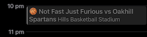

[![Contributors][contributors-shield]][contributors-url]
[![Forks][forks-shield]][forks-url]
[![Stargazers][stars-shield]][stars-url]
[![Issues][issues-shield]][issues-url]
[![GPL-3.0 License][license-shield]][license-url]
[![LinkedIn][linkedin-shield]][linkedin-url]

# Hills Basketball Draw Feed Calendar
Add your Hills Hornets basketball draw to you calendar.

The way the Hills Hornets website organises the draw information makes it a hasstle to lookup your games every week. Especially if you have a number of famility member who play in different teams. This project creates a lambda function that runns each day that reads the draw for every team in the compition and creates a calendar that can be subscribed to via a URL. 

# Hills Website API
The Hills website populates the draw page by calling the following API endpoints.
* `https://hillshornets.com.au/members/api/draw/seasons`
* `https://hillshornets.com.au/members/api/draw/seasons/<seasonId>/divisions`
* `https://hillshornets.com.au/members/api/draw/seasons/divisions/<divisionId>/draw`
* `https://hillshornets.com.au/members/api/draw/seasons/divisions/<divisionId>/teams`

# Known Issues
* There is no unique Team ID exposed by the API. Teams are identified by the combination of the SeasonID, DivisionID, and Team Name. This means that of there is a redraw that moves your team to another division or a new season starts, it will ceate a new calendar with a new filename. You will need to get the new URL and re-subscribe to your calendar.

[contributors-shield]: https://img.shields.io/github/contributors/dfevre/hills-draw-calendar.svg?style=for-the-badge
[contributors-url]: https://github.com/dfevre/hills-draw-calendar/graphs/contributors
[forks-shield]: https://img.shields.io/github/forks/dfevre/hills-draw-calendar.svg?style=for-the-badge
[forks-url]: https://github.com/dfevre/hills-draw-calendar/network/members
[stars-shield]: https://img.shields.io/github/stars/dfevre/hills-draw-calendar.svg?style=for-the-badge
[stars-url]: https://github.com/dfevre/hills-draw-calendar/stargazers
[issues-shield]: https://img.shields.io/github/issues/dfevre/hills-draw-calendar.svg?style=for-the-badge
[issues-url]: https://github.com/dfevre/hills-draw-calendar/issues
[license-shield]: https://img.shields.io/github/license/dfevre/hills-draw-calendar.svg?style=for-the-badge
[license-url]: https://github.com/dfevre/hills-draw-calendar/blob/master/LICENSE.txt
[linkedin-shield]: https://img.shields.io/badge/-LinkedIn-black.svg?style=for-the-badge&logo=linkedin&colorB=555
[linkedin-url]: https://linkedin.com/in/davidfevre
